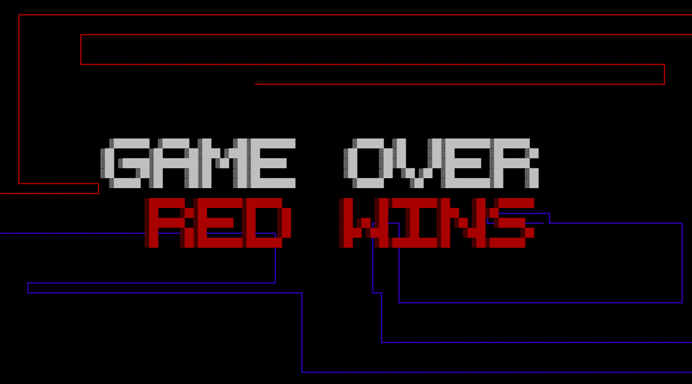
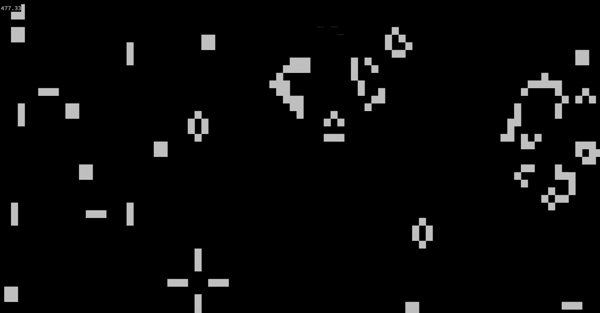
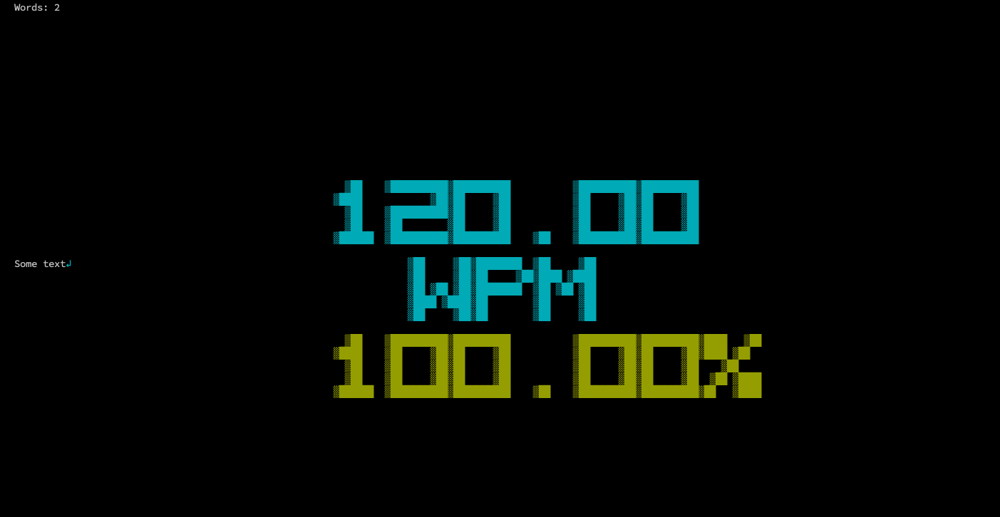

# Shell Graphics
## Snake
Run on a terminal with 200 x 50 characters.


## Tron
Simple tron based game where two players compete with each other. One player controls the blue (WASD)
bike while the second one controls the red bike (IJKL). The objective is to avoid the screen boundary
and the bike traces. If any of those are crossed, the game is over and the player that hit it will loose.
#### Options:
```shell
-w, --width    		Define the width of the terminal window the game will be ran on (characters).
-h, --height   		Define the height of the terminal window the game will be ran on (characters).
-px, --pixelWidth 	Define the width of a pixel (measured in characters).
-py, --pixelHeight 	Define the height of a pixels (measured in characters).
```


## Game of Life
Implementation of the Conway's Game of Life.
Source: https://en.wikipedia.org/wiki/Conway%27s_Game_of_Life
#### Options:
```shell
-w, --width    		Define the width of the terminal window the game will be ran on (characters).
-h, --height   		Define the height of the terminal window the game will be ran on (characters).
-px, --pixelWidth 	Define the width of a pixel (measured in characters).
-py, --pixelHeight 	Define the height of a pixels (measured in characters).
```


## Typing
Provide any text file and try to type its content as fast as possible in this program. At the end, the speed
and word accuracy will be displayed on the screen.
```shell
./typing textfile.txt
```
This program will automatically guess your terminal size.

