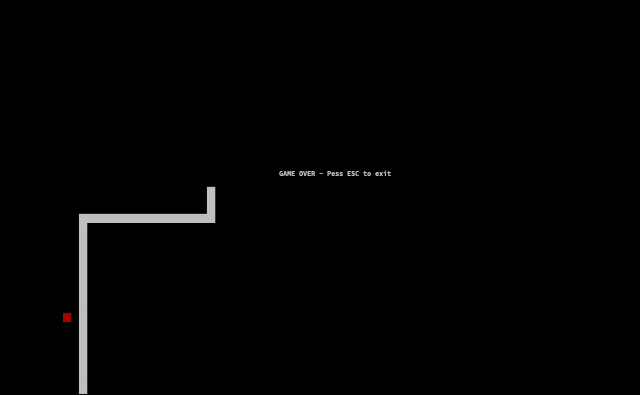

# Shell Graphics

## Snake
Run on a terminal with 200 x 50 characters.


## Tron
Options:
```shell
-w, --width    		Define the width of the terminal window the game will be ran on (characters).
-h, --height   		Define the height of the terminal window the game will be ran on (characters).
-px, --pixelWidth 	Define the width of a pixel (measured in characters).
-py, --pixelHeight 	Define the height of a pixels (measured in characters).
```


## Game of Life
Options:
```shell
-w, --width    		Define the width of the terminal window the game will be ran on (characters).
-h, --height   		Define the height of the terminal window the game will be ran on (characters).
-px, --pixelWidth 	Define the width of a pixel (measured in characters).
-py, --pixelHeight 	Define the height of a pixels (measured in characters).
```


## Typing
This program will automatically guess your terminal size.

